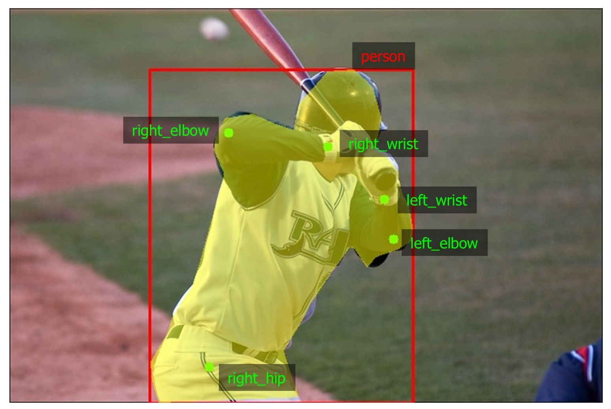
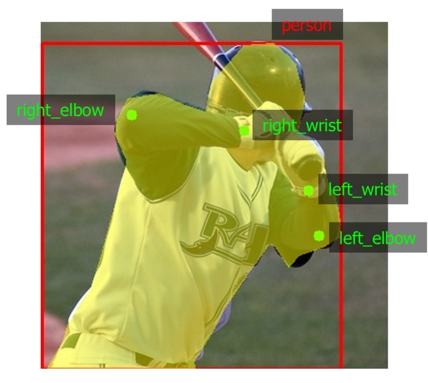

# Simultaneous augmentation of multiple targets: masks, bounding boxes, keypoints

Albumentations can apply the same set of transformations to the input images and all the targets that are passed to `transform`: masks, bounding boxes, and keypoints.

Please refer to articles [Image augmentation for classification](image_augmentation.md), [Mask augmentation for segmentation](mask_augmentation.md), [Bounding boxes augmentation for object detection](bounding_boxes_augmentation.md), and [Keypoints augmentation](keypoints_augmentation.md) for the detailed description of each data type.


!!! note "Note"
    Some transforms in Albumentation don't support bounding boxes or keypoints. If you try to use them you will get an exception. Please refer to [this article](transforms_and_targets.md) to check whether a transform can augment bounding boxes and keypoints.

Below is an example, how you can simultaneously augment the input image, mask, bounding boxes with their labels, and keypoints with their labels. Note that the only required argument to `transform` is `image`; all other arguments are optional, and you can combine them in any way.

## Step 1. Define `Compose` with parameters that specify formats for bounding boxes and keypoints.

``` python
transform = A.Compose(
  [A.RandomCrop(width=330, height=330), A.RandomBrightnessContrast(p=0.2)],
  bbox_params=A.BboxParams(format="coco", label_fields=["bbox_classes"]),
  keypoint_params=A.KeypointParams(format="xy", label_fields=["keypoints_classes"]),
)
```

## Step 2. Load all required data from the disk.
Please refer to articles [Image augmentation for classification](image_augmentation.md), [Mask augmentation for segmentation](mask_augmentation.md), [Bounding boxes augmentation for object detection](bounding_boxes_augmentation.md), and [Keypoints augmentation](keypoints_augmentation.md) for more information about loading the input data.

For example, here is an image from the [COCO dataset](https://cocodataset.org/). that has one associated mask, one bounding box with the class label `person`, and five keypoints that define body parts.


**An example image with mask, bounding boxes and keypoints**


## Step 3. Pass all targets to `transform` and receive their augmented versions
``` python
transformed = transform(
  image=img,
  mask=mask,
  bboxes=bboxes,
  bbox_classes=bbox_classes,
  keypoints=keypoints,
  keypoints_classes=keypoints_classes,
)
transformed_image = transformed["image"]
transformed_mask = transformed["mask"]
transformed_bboxes = transformed["bboxes"]
transformed_bbox_classes = transformed["bbox_classes"]
transformed_keypoints = transformed["keypoints"]
transformed_keypoints_classes = transformed["keypoints_classes"]
```


**The augmented version of the image and its targets**

## Examples
- [Showcase. Cool augmentation examples on diverse set of images from various real-world tasks.](/examples/showcase/)
